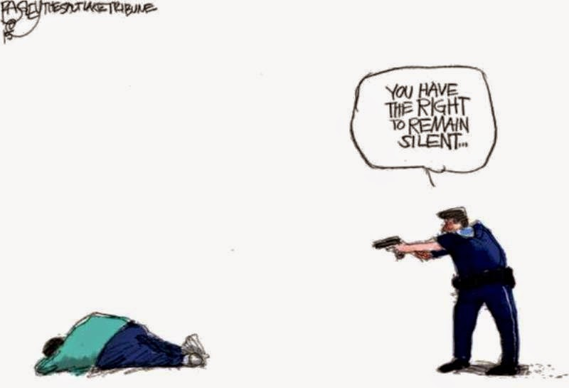

# Fatal Police Shootings

## Background

Investigated fatal police shooting data from 2015 to 2019 in the United States and extrapolated interesting insights through Jupyter Notebook using Python's Matplotlib visualization techniques

## Process

* Read the CSV file into Jupyter Notebook using Pandas

* Cleaned and manipulated the dataset 

* Explored various topics of discussion based on available data

## Analysis

**Fatalities Over 5 Years**

* Used a bar chart to show overall trend

* General decline in fatalities during the five years, but not a considerable amount worth noticing

    * 2019 has incomplete data because the year is still continuing

**Number of Shootings by State**

* Created both bar and stacked bar chart to portray information

* California had the highest amount of shootings by quite a large margin: 505 shootings

* Texas had the next highest shooting count with 286 shootings.

**Breakdown by Race**

* Manufactured a pie chart to show percentage of victims by race

* Majority of victims were Cacuasian at 51.7%, while Blacks and Hispanics were at 25.7% and 18.1% respecitvely

**Breakdown by Age**

* Created a bar chart and used the bin/cut method to show shootings by age

* The highest number of victims was between the ages of 25-35

* Hypothesized that this age range may make sense from a psychological perspective, where people at this age generally might be more prone to mental instability and aggression

    * To investigate this further, used "iloc" method to analyze the following conditions:

        * Threat level = "attack"

        * Flee status = "not flee" (which implies commitment to resisting cops)

        * Signs of mental illness = "true"

    * The age group of victims under these conditions was still between 25-35, which does not prove the theory, but may shed insight into it

## Deployment

* Download the PowerPoint file in the folder (includes all the necessary code)

