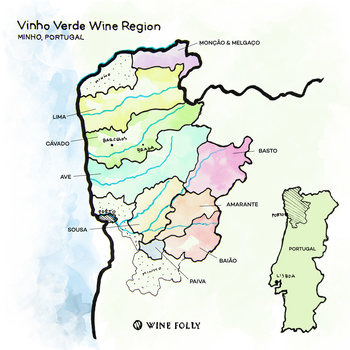

# Quality Wine

## Background

Using the UCI Machine Learning Dataset, implemented various classifcation models to compare relative predictive accuracies:

 * Random Forest / Decision Tree

 * Neural Networks

 * K Nearest Neighbors (KNN)

 * Support Vector Machine (SVM)

* Implemented the best fitting model, based on accuracy, into an interactive web application using Python's Flask app.

    * In this case, the Random Forest model produced the highest accuracy percentage.

* Users are able to select values within a specific range for each of the eleven categories and predict the overall quality of wine. 

* The wine quality is on a scale between 3-8, where a higher number indicates better quality.

## Deployment

* Download entire folder from Github

* Navigate to the parent directory via Command Line (make sure "app.py" file is there)

* Type into Command Line: "python app.py"

* Either copy/paste available link or go to web browser and type "localhost:5000"
