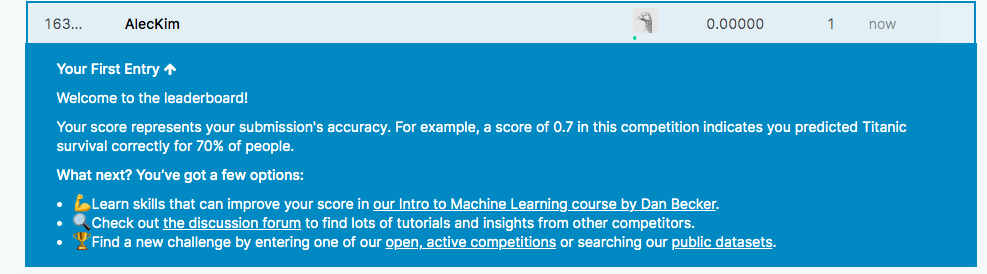

# Titanic Survivors

## Background

The sinking of the Titanic is one of the most infamous shipwrecks in history.

On April 15, 1912, during her maiden voyage, the widely considered “unsinkable” RMS Titanic sank after colliding with an iceberg. Unfortunately, there weren’t enough lifeboats for everyone onboard, resulting in the death of 1502 out of 2224 passengers and crew.

While there was some element of luck involved in surviving, it seems some groups of people were more likely to survive than others.

In this challenge, I built a predictive model that answers the question: “what sorts of people were more likely to survive?” using passenger data (ie name, age, gender, socio-economic class, etc).

## Process

* Using Python in Jupyter Notebook, imported the train and test CSV's provided 

* Performed data manipulation and cleaning to fill in missing values, create new columns where necessary, and transform the values into dummy variables for the machine learning model to train on

* Chose RandomForestClassifier supervised learning model to train the data, as it had the highest accuracy out of the other models 

    * RandomForestClassifier also allows you to list the features that have the most influence on the model

* With an accuracy of about ~83%, I put in the new test data that was provided into the machine learning model in order to predict whether the people survived or not

## Results

* Overall, the model I created had a 70% accuracy in predicting the survival of the passengers in the test set

* According to the model, the most impactful features were Sex, Age, and Fare

## Analysis 

* It makes sense that whether the passenger was male or female would be a good predictor whether he/she survived because usually in catastrophic situations, the cultural norm was to first make sure the women and children were okay

* A person's age would be a intuitive factor for survival because young children and women may have been prioritized over others of much older age

    * However, young adult males who were able-bodied to facilitate the survival of others, probably had a lower chance of survival

* A higher ticket price indicated that the passenger was in a higher boarding class (First, Second, Third), which also correlated with an increased survival rate due to preferential treatment 

